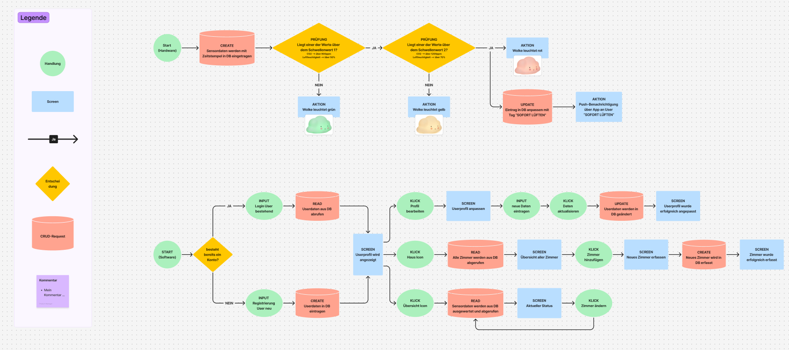
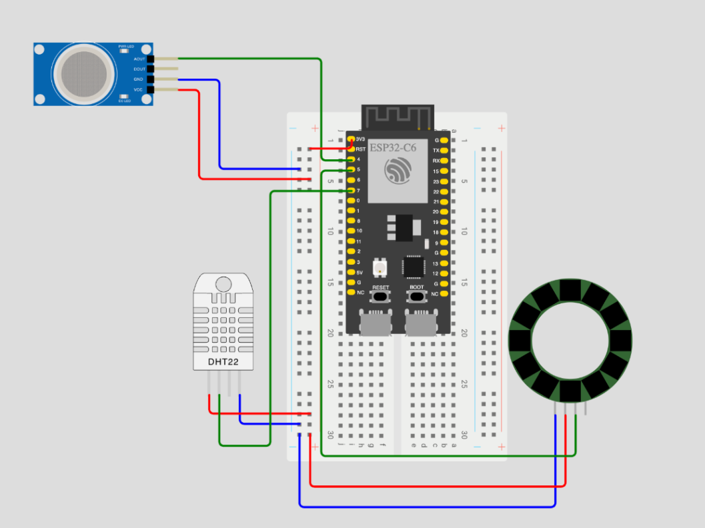
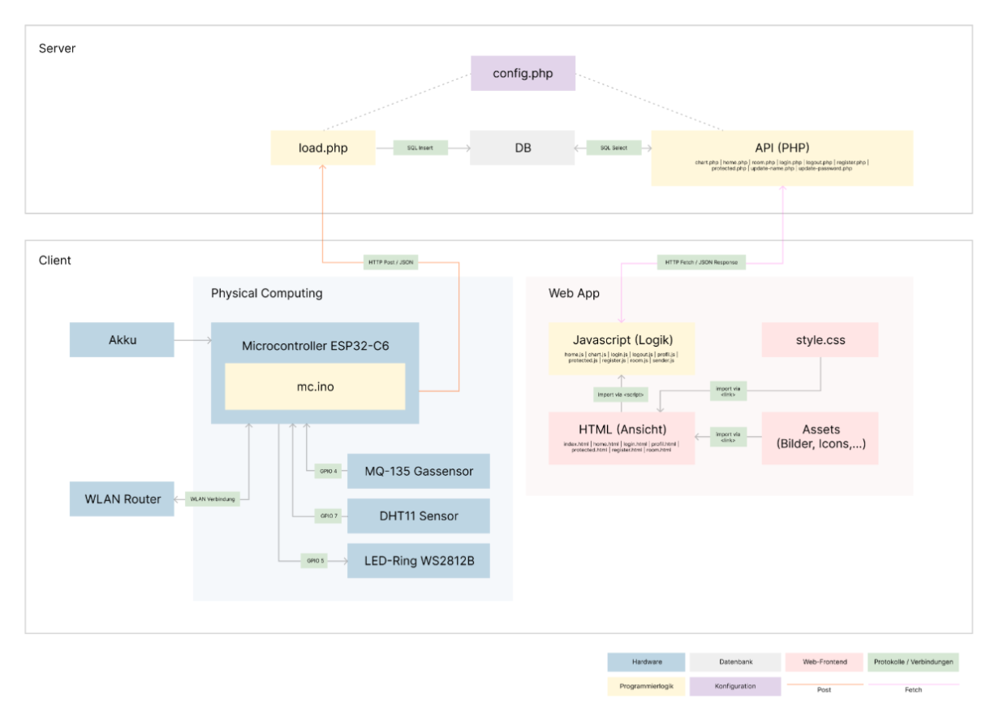
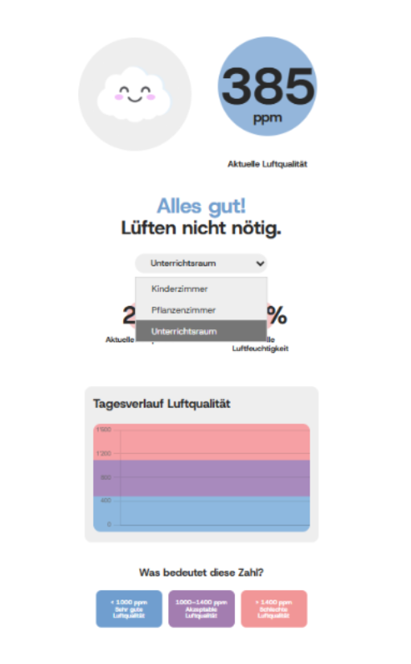
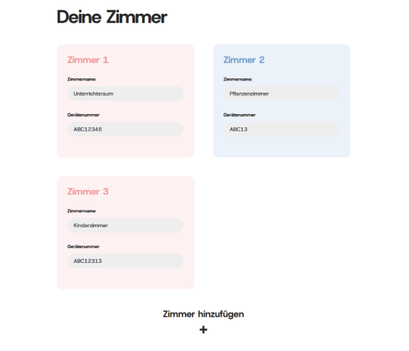

## Kurzbeschreibung des Projekts

* **Modul:** Interaktive Medien 4 an der Fachhochschule Graubünden (FS26)  
* **Themenfeld:** IoT-Applikation zum Thema Eltern mit kleinen Kindern  
* **Name des Projekts:** Cloudia  
* **Team Physical Computing:** Denja Amstutz und Alina Bosshard 
* **Team WebApp:** Melina Egger und Angelina Frühwirth
 
* Welches Problem im Alltag von Eltern mit kleinen Kindern wird gelöst? 
Mit Cloudia lösen wir das Problem, dass Eltern vergessen, in den Kinderzimmern (oder allgemein) zu lüften und somit unbewusst eine belastbare Luftqualität herrscht. 

* Was ist der „Sinn und Zweck“ des Systems?
Mit Cloudia gewährleisten wir eine verständliche Übersicht über die aktuelle Luftqualität, Temperatur und Luftfeuchtigkeit, damit in den Kinderzimmern für bessere Schlafqualität und Spiel- und Lernzeit der Kinder gesorgt werden kann. 


### UX & Konzeption

*In diesem Teil werden die gemeinsamen Schritte aus der UX-Abgabe dokumentiert, damit sich hier alles vollständig an einem Ort befindet (betrifft WebApp und Physical Computing)*

* **Figma:** https://www.figma.com/design/BGehWbuFD3NXz0xljYdVQw/IM4_Designs_CO2-Wolke?node-id=0-1
* **User Flow \+ Screen Flow**   
* *Welche Features waren angedacht?*
Grundsätzlich war unser Ziel, lediglich einen aktuellen Wert der Luftqualität und ein Diagramm mit einem Datepicker, damit alle gesammelten Daten eingesehen werden können. Ansonsten sollte man sich einloggen können, ein Profil erstellen und neue Zimmer und die damit verbundenen Sensoren registrieren können und diese in seinem Profil verwalten. So kann man auf der Übersichtsseite immer das Zimmer auswählen, von welchem man die Daten ansehen möchte. Ausserdem kann man auf der Profilseite seinen Benutzername und sein Passwort ändern.
* *Welche Features wurden nicht umgesetzt? (Warum)*
Ein Feature, das wir nicht wie gedacht umgesetzt haben, war das Diagramm mit dem Datepicker. Wir haben uns gefragt, wie sinnvoll es ist, wenn man die Luftqualität von einem Zimmer von vor einem Monat ansehen kann. Deshalb haben wir das Diagramm so geändert, dass man einfach den letzten 24 Stunden Verlauf sehen kann, ohne Datepicker.
Ausserdem mussten wir schlussendlich das Dropdown Menü für verschiedene Zimmer weglassen, weshalb aktuell jeweils nur ein Zimmer pro User möglich ist. 


### Setup

* **WebApp:** https://im4.angelina-fruehwirth.ch/    
* **Video-Dokumentation:** https://youtu.be/Ffgmb4Qh0l8 

#### Installationsanleitung WebApp

***verständliche** Schritt-für-Schritt-Anleitung für Aussenstehende, um das Projekt zu klonen und auf einem eigenen Server zu installieren*

1. *Was benötige ich an Infrastruktur?* 
Für die Installation der WebApp wird ein Hosting mit PHP-Unterstützung sowie eine MySQL-Datenbank benötigt. Für unser Projekt wurde ein Hosting bei Infomaniak verwendet.  
2. *Was muss ich auf meinem Webserver installieren?*
Bei Infomaniak sind PHP und MySQL bereits vorhanden. Die Projektdateien müssen lediglich per FTP oder Git auf das Hosting hochgeladen werden.  
3. *Wie kann ich die Datenbank importieren?* 
Im Projekt befindet sich die Datei db.sql, welche die Datenbankstruktur enthält. Diese kann über phpMyAdmin importiert werden.
4. *Wo muss ich die DB-Credentials eintragen?* 
Die Zugangsdaten der Datenbank werden in der Datei system/config.php eingetragen. Dort müssen Host, Datenbankname, Benutzername und Passwort angepasst werden. Nach dem Eintragen der Zugangsdaten kann die Website im Browser aufgerufen werden. Funktionieren Registrierung, Login und das Laden der Räume, wurde die Datenbank erfolgreich verbunden. Wichtig ist noch zu prüfen, dass die Datei config.php im .gitignore vorhanden ist, da die Zugangsdaten sonst auf Git landen. 
5. *Wie nehme ich das physische Artefakt in Betrieb?*
Das physische Artefakt muss gemäss der Dokumentation des Physical-Computing-Teams aufgebaut und mit dem WLAN verbunden werden.
Sobald die Sensoren aktiv sind, erfassen sie Werte wie CO₂-Gehalt, Temperatur und Luftfeuchtigkeit. Diese Daten werden über die definierte Datenschnittstelle an die Datenbank der WebApp übermittelt.

Für die WebApp ist wichtig, dass:
-die Datenbank erreichbar ist
-die Sensordaten korrekt in der Datenbank gespeichert werden
-die Sensor-ID einem registrierten Raum zugeordnet ist

Sobald neue Sensordaten in der Datenbank eintreffen, werden diese automatisch in der WebApp angezeigt und im 24-Stunden-Verlauf visualisiert. Die Kommunikation zwischen Physical Computing und WebApp erfolgt somit über die gemeinsame Datenbank.


#### Bauanleitung Physical Computing

* ***Was muss ich wie bauen, verbinden, installieren?*** 

*# Physischer Sensorknoten: Aufbau & Firmware 

Dieses Projekt beinhaltet einen vollautomatischen physischen Sensorknoten, der die Temperatur, die relative Luftfeuchtigkeit und die Gas-/CO₂-Konzentration der Raumluft misst. Die Daten werden lokal über eine interaktive LED-Ampel visualisiert und parallel im 15-Sekunden-Takt via WLAN an unseren Webserver zur Speicherung in einer relationalen MySQL-Datenbank übertragen. 

Folge diesen Schritten, um den physischen Sensorknoten nachzubauen, zu verkabeln und in Betrieb zu nehmen. 

#### A. Benötigte Hardware-Komponenten 
* 1x ESP32-C6 Microcontrollerboard
* 1x DHT11 Temperatur- & Luftfeuchtigkeitssensor *(Hinweis: Für den echten, physischen Aufbau)* 
* 1x MQ-135 Gassensor (Luftqualität / CO₂-Äquivalent) 
* 1x LED-Ring WS2812B
* 1x Akku LiFePo4 3000mAh
* Steckplatine & Jumper-Kabel m-m + f-f

#### B. Hardware-Verkabelung (Steckplan) 

Verkable das System gemäss dem vordefinierten Schema. Nutze die äusseren Stromschienen der Steckplatine für die gemeinsame Energieversorgung: 

**Wichtiger Hinweis zum Steckplan:** 
Da der DHT11-Sensor in der Bauteilbibliothek von Wokwi standardmässig nicht vorhanden war, wurde im digitalen Steckplan stattdessen der **DHT22**-Sensor verwendet. Die Pinbelegung und die logische Verdrahtung im Steckplan sind jedoch identisch mit dem realen DHT11-Setup. *

**Gemeinsame Schienen:** `3V3` des ESP32 an die rote Plus-Schiene (+), `GND` an die blaue Minus-Schiene (-) der Steckplatine. * 
**DHT11 / DHT22 (Wokwi):** VCC an (+), GND an (-), DATA / SDA an **GPIO 7**. 
**MQ-135 Gassensor:** VCC an (+), GND an (-), AO (Analog Out) an **GPIO 4**. * **LED-Ring WS2812B:** VCC an (+), GND an (-), DI / DIN (Data In) an **GPIO 5**. 



#### C. Firmware-Setup & Upload 
1. Öffne die **Arduino IDE** auf deinem Computer und installiere über den *Library Manager* folgende Bibliotheken: 
* `DHT sensor library` by Adafruit 
* `Adafruit NeoPixel` by Adafruit
2. Verbinde das ESP32-C6 via USB-C mit deinem Computer.
3. Wähle unter *Werkzeuge -> Board* das **ESP32-C6 Dev Module** aus. 
4. **Wichtig für die serielle Ausgabe:** Stelle im Menü unter *Werkzeuge -> USB CDC On Boot* zwingend auf **Enabled**, da sonst keine Live-Ausgaben im Seriellen Monitor angezeigt werden.
5. Öffne die im Repository hinterlegte Datei `mc.ino`.

6. Trage deine lokalen WLAN-Zugangsdaten in den Code ein:
 ```cpp 
const char* ssid = "DEIN_WLAN_NAME"; 
const char* pass = "DEIN_WLAN_PASSWORT";
7. Klicke auf Upload (Pfeil-Symbol), um die Firmware auf das Board zu brennen.
8. Nach dem erfolgreichen Upload kannst du den Seriellen Monitor (Lupe oben rechts, Baudrate: 115200) öffnen, um den Verbindungsaufbau live zu verfolgen und zu debuggen.
9. Sobald die WLAN-Verbindung steht, liest der ESP32-C6 die Werte ein, steuert die LED-Ampel und speichert die Daten vollautomatisch in der SQL-Datenbank ab.
10. Mobiler Betrieb: Nach erfolgreichem Testlauf kann das USB-Kabel entfernt und der ESP32-C6 mit dem Akku LiFePo4 3000mAh verbunden werden. Der Sensorknoten arbeitet nun autark weiter und überträgt die Messwerte drahtlos an die Datenbank.



## technische Details

// Hier sollte das Verständnis ersichtlich sein / Wie stehen die Dateien in Beziehung zueinander, Wie reden Die Dateien miteinander, Wie ist der Weg der Daten

* **Projektstruktur / Code-Struktur:** \[*Hinweis: Der Code selbst muss im Repository liegen und im Kopfbereich jeder Datei eine kurze Zusammenfassung enthalten.*\] 
Die Benutzeroberfläche der WebApp besteht aus mehreren HTML-Seiten wie login.html, register.html, room.html oder profil.html.
Im Ordner api befinden sich die PHP-Dateien für Funktionen wie Login, Registrierung, Logout sowie das Laden und Speichern von Daten. Die Datei system/config.php stellt die Verbindung zur Datenbank her. Die Datenbankstruktur befindet sich in der Datei db.sql. Für das Design der WebApp wird die Datei css/style.css verwendet. Zusätzliche Funktionen und Interaktionen werden über die JavaScript-Dateien im Ordner js umgesetzt.

* **Datenschnittstelle: \[***zwischen WebApp und Physical Computing*\] 
Die Sensoren erfassen Werte wie CO₂, Temperatur und Luftfeuchtigkeit. Diese werden in der Datenbank gespeichert und anschliessend von der WebApp ausgelesen und angezeigt. Die Datenbank dient dabei als Schnittstelle zwischen dem physischen Artefakt und der WebApp.  
* **ERM:** \[*Erklärung und Schaubild*\]  
* **Authentifizierung:** \[*Erklärung*\]
Benutzer können sich registrieren und anschliessend einloggen. Die Login-Daten werden mit den gespeicherten Daten in der Datenbank abgeglichen. Nach erfolgreichem Login können die eigenen Räume und Sensordaten eingesehen und verwaltet werden. 

## Known bugs

* Was funktioniert noch nicht einwandfrei?
Aufgrund einer Änderung ist es aktuell nicht möglich, dass man mehrere Zimmer registrieren kann. Man hat einfach die Möglichkeit, sein bestehendes Zimmer umzubenennen. Das liegt daran, dass wir nur einen Sensor zur Verfügung haben. Mehr Infos dazu weiter unten bei den verworfenen Ansätzen. 
* Was ist uns aufgefallen bei der Entwicklung?
Bei der Entwicklung ist uns relativ schnell aufgefallen, dass wir gar nicht alle Seiten, die wir im Figma ursprünglich angedacht hatten, auch wirklich benötigten, wie zum Beispiel die Zwischenseiten “Die Registrierung war erfolgreich” oder “Die Anmeldung war erfolgreich”. Das waren unserer Meinung nach unnötige Zwischenschritte, die auch aus UX-Sicht nicht wirklich einen Mehrwert bieten. 
* Was könnte noch verbessert werden?
Das Zusammenspiel der angezeigten Farben mit der App könnte man noch optimieren, um das Verständnis zu vereinfachen. Wenn nun die gemessene Luftqualität gut ist und der Ring grün leuchtet, könnte man das auch in der WebApp entsprechend in Grün darstellen. So würde man auf den ersten Blick verstehen, dass alles in Ordnung ist und keine Handlung erforderlich ist. Dasselbe natürlich auch auf die andere Seite mit Rot, das dringende Handlung erfordert. 

## Umsetzungsprozess

* **Reflexion / Erfahrung / Lernfortschritt:** *Was haben wir gelernt? Würden wir es nochmal genauso machen? Was war gut, was war schlecht?*  
Wenn wir unsere Skills vergleichen mit dem vorherigen Semester, waren wir beim Programmieren und dem Verknüpfen der Datenbank selber sehr überrascht, wie viel schneller es diesmal geklappt hat. Im vorherigen Semester brauchten wir viel mehr Unterstützung und wir standen einige Male an und kamen nicht richtig vom Fleck. 

Zu Beginn war es etwas herausfordernd zu verstehen, wie die verschiedenen Tabellen der Datenbank zusammenspielen und wie genau die Verknüpfung von Webapp und Sensor funktionieren soll. Schlussendlich hat es aber gut funktioniert und wir haben uns auch durch einige Komplikationen schlussendlich ein besseres Verständnis über die ganze Logik erarbeitet.

* **Herausforderungen & Lösungen:** \[*Verworfene Ansätze, Fehler, Umplanungen*\] 
Wir kämpften einige Male mit der Datenbank, ganz besonders beim initialen Aufsetzen, da wir uns das nicht vorstellen konnten. Durch eine Skizze, die wir mit Wolfgang angefertigt hatten, fiel es uns schliesslich viel leichter, das Zusammenspiel zu verstehen. Ursprünglich war die Anwendung für mehrere Räume und Sensoren konzipiert. Also, dass jeder Sensor mit einer Seriennummer versehen wird und einem Raum und einem User zugeordnet ist. Ein User kann natürlich auch mehrere davon bei sich im Haus rumstehen haben und deswegen haben wir auch die Datentabelle Sensors konzipiert. Bei der Zusammenführung mit dem Physical-Computing-Team stellten wir dann aber schnell fest, dass da irgendwas nicht stimmt. Da wir die Datenbank und den Code auf mehrere Sensoren ausgelegt hatten, aber natürlich nur einen haben, mussten wir umdenken und die Architektur an den vorhandenen Prototypen anpassen. Die Messwertanzeige erfolgt nun direkt aus der Tabelle sensordata und nicht mit dem Umweg durch die Tabelle Sensors. Auch die room seite musste daher umgebaut werden. Anstatt der manuellen Vergabe einer Seriennummer und dem beliebigen Ergänzen von Räumen, wie man unten im Screenshot sieht, erhält man nun einen Überblick über seinen Raum und kann den Namen dort bearbeiten.
Die Raumverwaltung dient also ausschliesslich der Benennung des überwachten Raumes. Somit entfiel auf der home seite dann folglich auch das Dropdown-Menü, wo man vorher den gewünschten Raum anzeigen lassen konnte. Falls man das Projekt aber skalieren würde und mehrere Prototypen herstellen würde, könnte man den Code wieder zurücksetzen, wie wir es ursprünglich angedacht hatten.

### Alte Home Ansicht


### Alte Room Ansicht


* **KI-Einsatz:** *Dokumentation der verwendeten KI-Tools und deren Nutzen (KI ist nicht verboten)* 
Ein wertvolles Werkzeug für das Programmieren der WebApp war Chat GPT. Mit ausführlichen Prompts, passenden Stichworten und etwas Geduld hat das Tool schon einige Male geholfen, Fehler zu identifizieren und komplexere Funktionalitäten wie die Möglichkeit, den Namen und das Passwort zu ändern, umzusetzen. Zudem nutzten wir Gemini um Schaupläne in einem ersten Schritt zu visualisieren damit wir uns das genauer vorstellen konnten wie alles zusammenspielt.

* **Fazit:** …
Das Projekt war ziemlich umfangreich und wirkte anfangs etwas abschreckend, aber dafür war die Freude und das Erfolgserlebnis dann umso grösser, als wir die beiden Komponenten verbunden haben und die Daten vom Prototyp einwandfrei in die Datenbank eingespeist wurden. Es ist immer wieder ein tolles Gefühl zu sehen, wie aus einem Figma Prototypen eine funktionierende Seite entsteht, besonders nach langem hin und her Tüfteln.